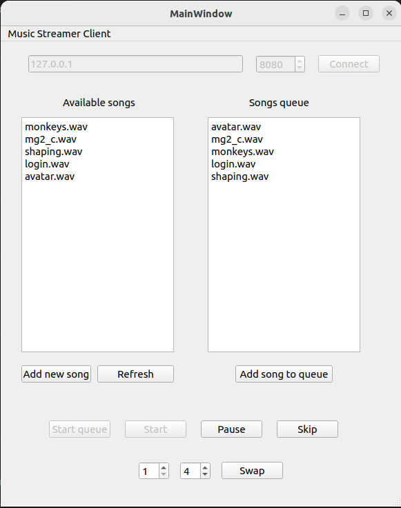

# Music Streamer

## How to run:
### Server
```
cd server
mkdir build
cd build
cmake ..
make
./server <port>
```

### Client
To run the client open its CMakeLists.txt in Qt Creator and run it. Make sure to have Qt 5 or 6 with Network package installed on your computer. \
For playing music the client uses library `irrKlang` which uses ALSA to play sounds.

### Play
You can check if the music will play as expected (to check if you have ALSA) in the `client` application by first trying the `play` application. To build and run this app:
```
cd play
mkdir build
cd build
cmake ..
make
./play
```

## What can I do in this app
- Client can connect to the server by providing host address and port and clicking **Connect**
- Client can upload new *.wav* file to the server by using **Add new song**
- Client can see what songs available on the server to play by clicking **Refresh** button
- Client can add song from available songs to the end of the queue by clicking **Add song to queue** and choosing a song
- Client can start the queue by clicking **Start queue** button. Music will start streaming to all clients.
- Client can **Start** and **Pause** music. Every client will also see (or actually hear) results of this.
- Client can **Skip** to another song.
- Client can **Swap** to songs in the queue.

## GUI



## Built using
- C/C++
- Qt
- BSD sockets
- irrKlang